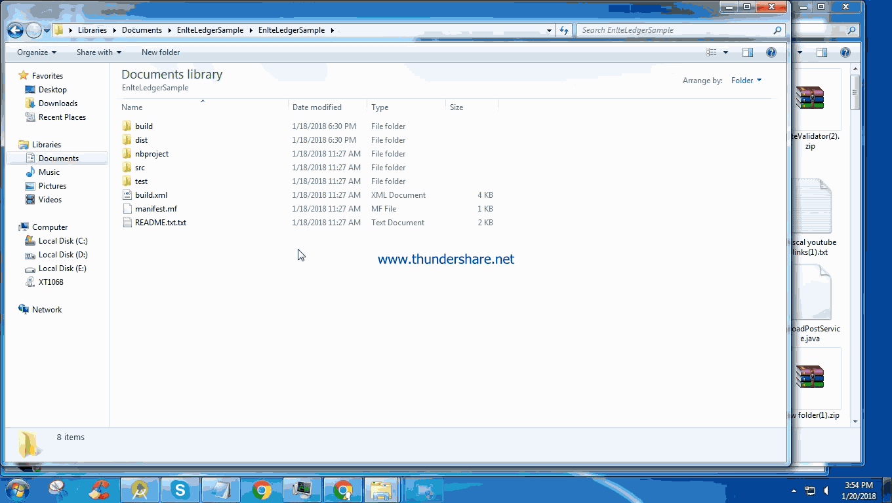

# Enlte
We propose a location-based small world social internet with the characteristics of providing more
intelligent queries, connections and better results. Giving one universal identity of user with power of
being anonymous. Using the power to rating an experience to develop a database of a universal
reputation system based on blockchain with hierarchy of Maple Roots. Giving an opportunity to the users
to rate their experiences, problems and broadcast it to the people nearby as well as geostamp &
geo-fencing it forever. Other users, organisations can help resolve the issue or bad experience or we will
be able to spread awareness to help other people from similar experience. Decentralising the power to
the people by motivating users to help each other and spread awareness and earn enlte tokens in
exchange of that.

# Introduction: 
This app is an desktop application. It is used to view the logs of all ongoing transaction in blockchain. These trasactions are public and each user can view the all updates.

# Requirements:
To run this app in your system, you must have install java 1.8. For windows only jre(Java) is required and for other OS you need to install complete package of Java. Below is the link of java:
1. JRE: http://www.oracle.com/technetwork/java/javase/downloads/jre8-downloads-2133155.html
2. JDK: http://www.oracle.com/technetwork/java/javase/downloads/jdk8-downloads-2133151.html

# Installations:
You can directally open this app without installing into the system. You have to click on EnlteLedger.jar file then it will automatically open the app in terminal and asks for user id. If it is not asking the user id then you have to manually enter the below command.
java -jar EnlteLedger.jar
But, please confirmed that you are on the main directory of project in command prompt.

# Usage

# Build Path: 
You can find the build under dist folder.

# Maintainers:

Current maintainers: Rakesh (Android & java developer)

This project has been sponsored by: Enlte Team

You can find Android app in below link: https://play.google.com/store/apps/details?id=com.mpas.enlte
